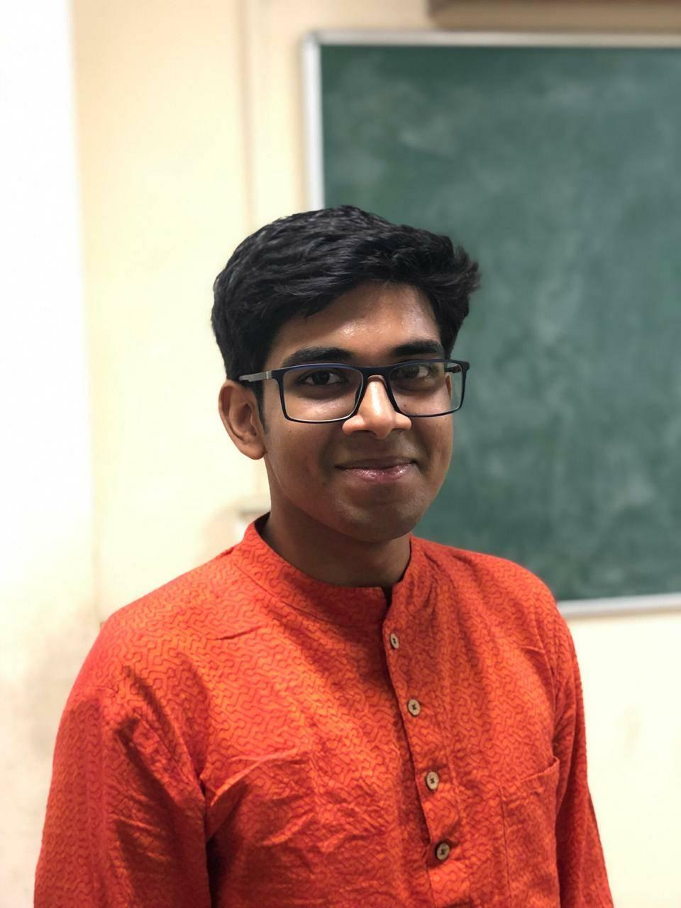
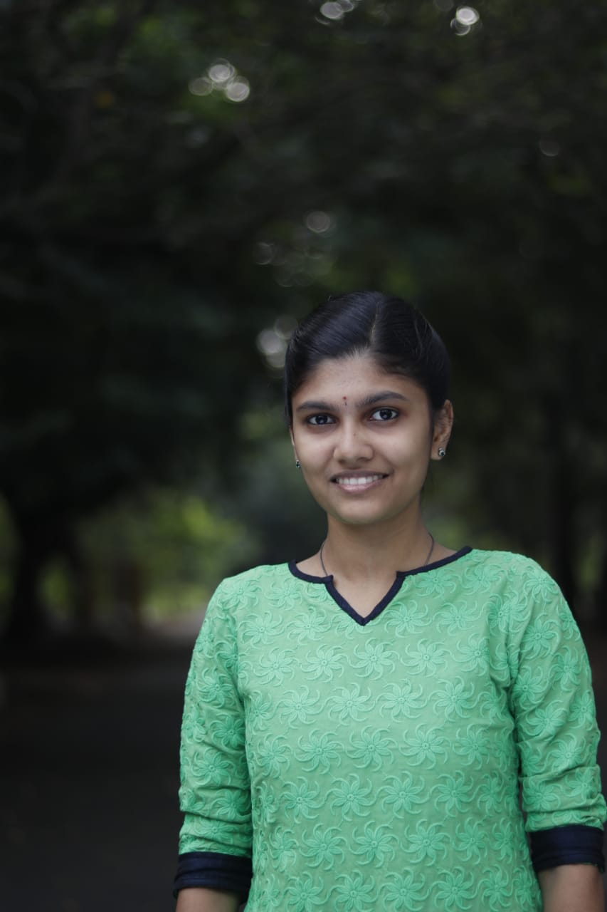
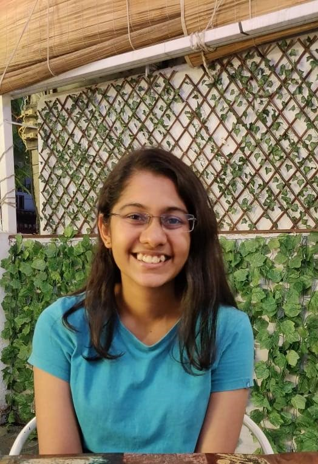
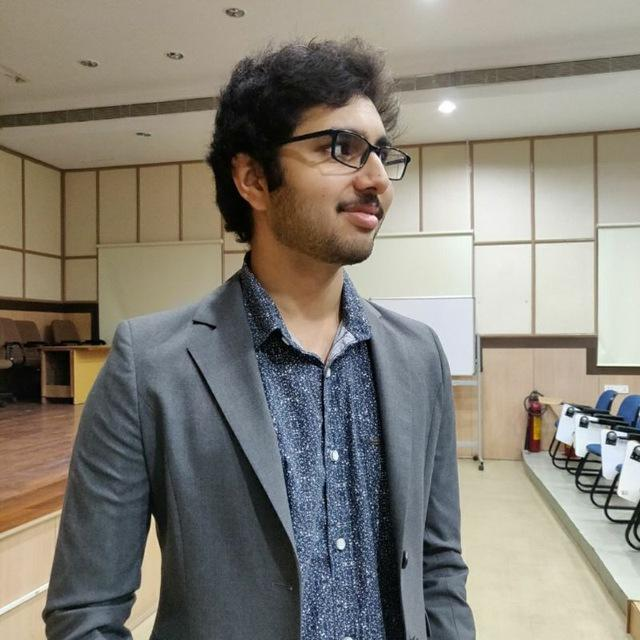

Biotech Research Club is a student run organisation at IIT Madras which serves as a platform to promote, discuss and encourage research in biology and allied fields. 

## Meet The Team!

## Heads

### Burhan Sabuwala 

I'm a fourth-year undergraduate majoring in biological engineering and data science. I'm interested in addressing questions related to human diseases from a computational or data-driven lens and very excited by complex and dynamic systems. I also like to read and understand science policy.

### Sahana Gangadharan 

I'm a fourth-year undergraduate majoring in biological engineering. I'm interested in understanding the various aspects that govern development and communications within the brain, soul-stirring music and movies, and meeting new people.

### Sankalpa Venkatraghavan 

I'm a fourth-year undergraduate majoring in biological engineering. I’m interested in research centred on questions from biology - especially those studied using the integrated approach of experiments, modelling and theory, books that make you feel things and the art of science communication. 

### Sathvik Anantakrishnan

I'm a fourth-year undergraduate majoring in biological sciences. I'm interested in interdisciplinary research, particularly in the use of physics and mathematical modeling to understand living systems. Outside of science, I love cats and all kinds of books.

