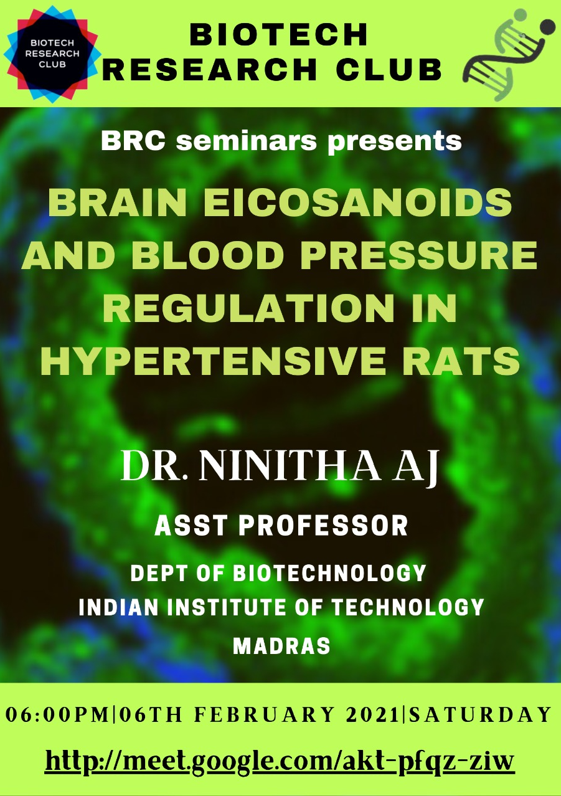

## [I. Alumni Talks](https://biotechstudentassociation.github.io/biotechresearchclub/alumnitalks/)                [II. Seminars](https://biotechstudentassociation.github.io/biotechresearchclub/seminars/)

---
## Upcoming Talks
---

Stay tuned!

---
## Old Talks 
--- 

The Biotech Research Club is very excited to host Prof. Ninitha AJ, a new member of the Department of Biotechnology, Bhupat and Jyothi Mehta School of Biosciences, IIT Madras.

<b> Title: </b> Brain eicosanoids and blood pressure regulation in hypertensive rats

<b> Date and Time: </b>  Saturday, 6th February, 2021 at 6 PM

<b> Link: </b>  [https://meet.google.com/akt-pfqz-ziw](https://meet.google.com/akt-pfqz-ziw)

<b>Biography of the Speaker:</b>

Ninitha AJ completed her veterinary science degree from Madras Veterinary College, Chennai. She got her PhD from Michigan State University, where she was mentored by Professor Gregory D. Fink’s, an expert in cardiovascular and neuroscience research. For her postdoctoral training, she moved to University of Minnesota, where she studied the role of renal nerves in metabolic syndrome development and also studied the role of spinal cord stimulation in altering blood pressure regulation in human hypertensives. Later, she joined the Indian Institute of Science, Bangalore as an Inspire faculty and used whole body knock out and knock in mouse models to study cardiac hypertrophy and diabetes development.

<b> Abstract: </b>

Hypertension is a major risk factor for cardiovascular diseases like heart failure and stroke. Previously, central cyclooxygenase-1 inhibition was found to prevent the development of angiotensin II (AngII)-salt hypertension and sympathetic hyperactivity in rats. Our data suggested a significant up-regulation of lipocalin type prostaglandin D synthase (L-PGDS) mRNA levels in the organum vasculosum lamina terminalis, a circumventricular organ. This was accompanied by a significant increase in L-PGDS protein levels in the choroid plexus lining the ventricles. Therefore, it was hypothesized that the enzyme L-PGDS in the brain is critical for the development of hypertension in this model. To test this hypothesis, radio-telemeter devices were implanted in adult male Sprague Dawley rats for hemodynamic measurements. The study data established that L-PGDS is critical for the development of AngII-salt hypertension stressing the need for 1) studying the role of L-PGDS as a possible target for treating neurogenic hypertension and 2) developing targeted brain drug delivery tools in human hypertensives.

---

The Biotech Research Club is very happy to announce that this week's edition of our Alumni Talks Series features Dr. Swathi Ayloo an alumnus of the Batch of 2010, who is currently doing a postdoc at Harvard Medical School. 

<b> Title: </b> Intracellular communication regulating Blood-Brain Barrier Integrity

<b> Date and Time: </b>  Friday, 29th January, 2021 at 7:30 PM

<b> Link: </b>  [https://meet.google.com/qpm-jrga-hcy](https://meet.google.com/qpm-jrga-hcy)

<b>Biography of the Speaker:</b>

Dr. Ayloo did her undergraduate degree at IIT Madras in the Dept. of Biotechnology and went on to do a Ph.D. at the University of Pennsylvania. Her research thesis was focused on understanding transport mechanisms at the single-molecule level as well as within cells. She also developed and implemented tools to optogenetically manipulate trafficking within neurons to better understand regulatory mechanisms of molecular transport in the nervous system. She is currently doing a postdoc at Harvard Medical School working at the interface of neuronal and vascular biology, focusing on the blood-brain barrier. 

<b> Abstract: </b>

Blood-central nervous system (CNS) barriers are functional interfaces separating the neural tissue from circulating blood and are essential for neuronal function and cellular homeostasis. Endothelial cells forming the walls of the blood vessels make up these barriers. Barrier properties are not intrinsic to CNS endothelial cells, but rather, are induced by the underlying microenvironment of the tissue. The specific extrinsic factors from perivascular cells that regulate barrier formation are, however, largely unknown. Here, I present a brief overview of our current understanding of how perivascular cells induce barrier properties in the CNS and provide some of our current findings in this area.

---

This week's edition features Shruthy Suresh Aggarwal, an alumnus of the Batch of 2013 who is currently a postdoctoral fellow in the Department of Cancer Biology & Genetics, Memorial Sloan Kettering Cancer Center.

<b> Title: </b> A CRISPR-Cas9 screen reveals novel mechanisms of PD-L1 regulation in human lung Cancer

<b> Date and Time: </b>  Thursday, 21st January, at 6:30 PM

<b> Link: </b>  [meet.google.com/njj-nxzw-mra](meet.google.com/njj-nxzw-mra)

<b>Biography of the Speaker:</b>

Dr. Shruthy Suresh Aggarwal was born and raised in Chennai for 21 years and received a B.Tech in Biotechnology from IIT Madras in 2013. During this time, she worked in Dr. Karungaran Devarajan’s lab in the Department of Biotechnology for her Bachelors thesis work. A summer of exciting research at Michigan State University as a Khorana Scholar in 2012 motivated her to pursue graduate studies in the US. She obtained her Ph.D in Cancer Biology from the University of Texas, Southwestern Medical Center as an HHMI Med to Grad fellow in 2019. Her Ph.D thesis work in Dr. Kathryn O’Donnell’s laboratory has focused on using CRISPR based screening to identify regulators of the PD-L1 immune checkpoint in lung cancer. Her work contributed to the lab being awarded several grants: Welch Foundation Grant 2018, Friends of the Comprehensive Cancer Center Award in Cancer Research 2017 and NCI SPORE in Lung Cancer Career Development Award 2016. Shruthy is currently a postdoctoral fellow in the Department of Cancer Biology & Genetics, Memorial Sloan Kettering Cancer Center. Her work on melanoma metastasis in Dr. Richard White’s lab is funded by a Melanoma Research Foundation Career Development Award and a Translational Research in Oncology Training award.

<b> Abstract: </b>

Cancer cells express high levels of PD-L1, a ligand of the PD-1 receptor on T cells, allowing tumors to directly suppress T cell activity. Monoclonal antibody-based checkpoint inhibitor blockade (CIB) therapeutics (including anti-PD1 and anti-CTL4 therapies alone or in combination) have revolutionized the treatment of non-small cell lung cancer (NSCLC) and are now used as front-line therapy. However, only ~20% of all NSCLCs benefit from checkpoint blockade. Therefore, it is imperative to understand the mechanisms regulating immune checkpoints in lung cancer. We used Clustered Regularly Interspaced Short Palindromic Repeats (CRISPR)- based screening to identify regulators of PD-L1 in human lung cancer cells. Uroporphyrinogen Decarboxylase (UROD), a key enzyme in the heme biosynthesis pathway, was identified as a potent PD-L1 negative regulator. We show that impairment of heme production, which activates the Integrated Stress Response (ISR), results in enhanced PD-L1 translation. PD-L1 translation is repressed by non-canonical upstream open reading frames in its 5’ UTR, which are bypassed by ISR pathway activation, leading to suppression of anti-tumor immunity. We demonstrate that ISR-dependent translation of PD-L1 requires the translation initiation factor EIF5B. EIF5B overexpression, which is observed in human lung cancers and associated with poor prognosis, is sufficient to induce PD-L1. These findings uncover a new mechanism of immune surveillance regulation and suggest novel targets for therapeutic intervention.

---

The Biotech Research Club is excited to host Srinivas Allanki, a final year PhD student working with Dr. Sven Reischauer and Prof. Didier Stainier at the Max Planck Institute for Heart and Lung Research in Germany. Using the highly regenerative
zebrafish as a model system, he studies the fundamental mechanistic differences between regeneration, and forming a permanent and functionally inert scar after tissue damage. He is an alumnus of the dual degree (B.Tech and M.Tech) biological engineering program of IIT Madras. 

<b> Title: </b> Mechanisms that define regeneration vs. scarring.

<b> Date/Time: </b> 6.30 pm, 19th December 2020

<b> Link: </b> [https://meet.google.com/fum-odmb-oas](https://meet.google.com/fum-odmb-oas)

<b> Biography of the Speaker: </b>

Srinivas Allanki graduated from the IIT Madras B.Tech. + M.Tech. Biotechnology dual degree program in 2016. He is now a final year Ph.D. student working with Dr. Sven Reischauer and Prof. Didier Stainier at the Max Planck Institute for Heart and Lung Research in Germany. Using the highly regenerative zebrafish as a model system, he studies the fundamental mechanistic differences between regeneration and forming a permanent and functionally inert scar after tissue damage.

<b> Abstract: </b>

The two diametrically opposed outcomes of tissue damage are fibrosis and scarring, or
regeneration and functional repair. Species like zebrafish predominantly display a regenerative
program resulting in the functional replacement of injured tissues, including the heart and
appendages. Adult mammals predominantly activate a fibrotic program leading to the formation of a
functionally inert scar. A key question remains as to how regenerative species escape an excessive
fibrotic response. In this study, using combinatorial expression profiling and analyzing regeneration
of multiple tissues in five mutants, we identify the first global upstream mechanism of regeneration
in zebrafish. Moreover, using lineage tracing and human primary cell culture, we show that this
mechanism prevents mammalian-like scarring in zebrafish. These observations open a novel entry
point into the question as to why mammals react to tissue damage predominantly by fibrotic scarring
over activating a regenerative program.

---

The Biotech Research Club is excited to host Dr. Aman Kumar, a post doctoral associate at the Goodman lab in the Yale School of Medicine. He obtained his PhD from UT Southwestern Medical Center in Molecular Microbiology in 2020 and his B.Tech in Biotechnology from
IIT Madras in 2015.

<b> Title: </b> Interplay between tryptophan metabolites and the virulence factors of enteric pathogens

<b> Date/Time: </b> 7:15pm, 12th December 2020

<b> Link: </b> [https://meet.google.com/syj-mbcy-zxq](https://meet.google.com/syj-mbcy-zxq)

<b> Biography of the Speaker: </b>

Dr. Aman Kumar graduated from IIT Madras in 2015 with a  B.Tech + M.Tech in Biotechnology and went on to do a Ph.D. at the University of Texas Southwestern Medical Center, where he worked on host-pathogen-commensal interactions in the human gut in the lab of Prof. Vanessa Sperandio. He is currently a postdoctoral research associate in the lab of Prof. Andrew Goodman at the Yale School of Medicine.

<b> Abstract: </b>

Microbial establishment within the gastrointestinal (GI) tract requires surveillance of the gut biogeography. The gut microbiota coordinates behaviors by sensing host- or microbiota-derived signals. Here we show that the tryptophan derivatives including the microbiota-derived indole and the host-derived serotonin decreases the virulence of enteric pathogens. We utilized C. rodentium (a mouse-specific model pathogen) to understand the dynamics of host-pathogen-microbiome interactions and show that both indole and serotonin decrease the expression of virulence-related genes in C . rodentium. Mechanistically, we also identified the bacterial membrane bound histidine kinase CpxA as an indole and serotonin sensor. Taken together, our data indicate that bacterial pathogen senses the gut info-chemicals to establish a successful infection. 

---

The Biotech Research Club is excited to host Ms. Nandita Damaraju, an alumnus of the 2014 batch of the B.Tech Biotechnology program from IIT Madras. She is currently a machine learning scientist at Inflammatix Inc., San Fransisco, USA.

### Click on the image below to watch the recording!

<b> Title: </b> Data Science opportunities in Biotech

<b> Date/Time: </b> 9.30 pm, 8th December 2020

<b> Link: </b> [https://meet.google.com/shv-bqzk-vwd](https://meet.google.com/shv-bqzk-vwd)

<b> Biography of the Speaker: </b>

Nandita Damaraju completed her bachelor's degree in Biotechnology from IIT Madras in 2014. She is currently Machine Learning Scientist at Inflammatix, Inc. San Francisco, USA. She has previously also worked at Thermo Fisher Scientific as a Data Scientist. She holds a master's degree in Computational Science and Engineering from Georgia Institute of Technology.

<b> Abstract: </b>
Data science is being increasingly leveraged to solve many problems in the biotech industry. Within the Biotech industry, however, data science can mean many different things depending on the company or application. As a Machine Learning Scientist in the biotech industry, I want to talk about my experience navigating the plethora of opportunities available at this exciting interdisciplinary intersection, how data science in biotech differs from other industries, and the rich potential of avenues combining life and data science.

___

The Biotech Research Club is very happy to feature Prof. Hema Chandra Kotamarthi, a new member of the IIT Madras faculty. Prof. Kotamarthi obtained his Ph.D. in biophysical chemistry/molecular biophysics under the guidance of Dr. Sri Rama Koti Ainavarapu at the Tata Institute for Fundamental Research, Mumbai. He then moved to Boston and worked as a post-doctoral fellow of the Howard Hughes Medical Institute in the lab of Prof. Tania Baker in the Department of Biology, Massachusetts Institute of Technology. 
He is now an Assistant Professor at the Department of Chemistry, IIT Madras. We're excited to have you all join us for the talk.

<b> Title: </b> Probing nano-mechanics of protein unfolding and translocation using single-molecule force spectroscopy

<b> Date/Time: </b> 6 pm, 27th November 2020

<b> Link: </b> [https://meet.google.com/tpn-mfrf-bmw](https://meet.google.com/tpn-mfrf-bmw)

<b> Abstract: </b>
Single-molecule force spectroscopic (SMFS) techniques have enhanced our understanding of the role of mechanical forces in protein and enzyme biophysics, either by actively applying mechanical forces or by passively monitoring individual enzymatic processes held at a force. They have been used extensively to probe protein unfolding kinetics/pathways as well as mechanisms of biological molecular motors. In the current talk, I will discuss my research on the application of the commonly used SMFS techniques, optical tweezers (OT) and Single-molecule Atomic force microscope (SM-AFM) to probe the nano-mechanics of protein unfolding and translocation by ATP-dependent molecular motors. I will elaborate on how an OT based single-molecule assay has been applied to decipher the role of substrate directionality on protein degradation by ATP-dependent proteases as well as to probe the contribution of individual ATPase rings in a double ring protease. I will also highlight my research on the application of SM-AFM to co-relate the structure, sequence and mechanical stabilities of proteins as well as investigate the mechanical unfolding pathways of peri-plasmic binding proteins.

___
Biotech Research Club is hosting a talk by Jay Panji, a PhD scholar at Université Libre de Bruxelles in Brussels, Belgium. The talk will be followed by a general discussion session for students to interact with the speaker. 

<b> Title: </b> Modeling the development and function of the blood-brain barrier in zebrafish.
 
<b> Date/Time: </b>  7PM, 21st November 2020

<b> Venue: </b> Google Meet

<b> Link: </b> [http://meet.google.com/ket-pqsu-aum](http://meet.google.com/ket-pqsu-aum)

<b>Biography of the Speaker:</b>
Jay Panji is currently a first-year PhD candidate at the Université Libre de Bruxelles in Brussels, Belgium. His research interests lie in understanding the mechanisms involved in blood-brain barrier formation and how they are perturbed in neurodegenerative disorders. He is currently working on developing a zebrafish model of the blood-brain barrier.  

<b>Abstract:</b>
Blood vessels are more than passive conduits for blood flow. Tissue-specific vascular beds not only match the metabolic demands of the perfused organs but also act as important signalling centres releasing angiocrine factors that govern tissue morphogenesis and function. Proper brain function relies on elaborate neurovascular communications that, when perturbed, often have disabling or fatal consequences. Hence, there is great interest in studying the mechanisms that shape the anatomy and control the functionality of the cerebrovasculature, not only to better understand how the brain develops and works, but also to elaborate innovative therapeutic strategies for neurological disorders. Neurovascular biology is a relatively young field and an integrated model of how, when and to what extent neural and vascular development are coordinated is currently lacking. Building this model will greatly benefit from the combined capacity to (i) scrutinize the cellular modalities of the highly dynamic processes of neurovascular development in real-time and to (ii) identify experimental settings where the signalling and circulatory functions of the blood vessels can, at least partially, be uncoupled.

____
Biotech Research Club is hosting a talk by Dr. Kartik Gupta, a graduate student in the Cell and Molecular Biology program at the University of Wisconsin – Madison. The talk will be followed by a general discussion session for students to interact with the speaker.  

<b> Title: </b> Helming Yama’s Buffalo: Molecular Regulation of RIPK3 Mediated Programmed Necrosis in Physiology and Disease

<b> Date/Time: </b>  7.30 PM, 6th November 2020

<b> Venue: </b> Google Meet

<b> Link: </b> https://meet.google.com/hmm-qujj-qrp 

<b>Biography of the Speaker:</b>
Kartik Gupta grew up in New Delhi and received a bachelor's degree in Biotechnology from Amity University and was a summer research fellow in many institutes such as ICGEB, NII, JNU and AIIMS. Driven by the scientific curiosity that this training had instilled, he joined the MS (research) program at IIT-M and worked in Dr. Aradhyam Gopala Krishna's lab from 2012-14 while spending one semester as part of DAAD scholarship at TU-Munich. He joined the Cell and Molecular Biology (CMB) graduate program at the University of Wisconsin-- Madison in 2014 in the lab of Dr. Bo Liu where he studied the basic science aspects of cell death with relevance to cardiovascular diseases. Outside of the lab, he is a coffee aficionado and also enjoys weightlifting and running.

<b>Abstract:</b>
Multiple programmed cell death (PCD) pathways have been discovered over the past 15 years that have challenged the synonymity of PCD with apoptosis. RIPK3 mediated programmed necrosis (or necroptosis) is unique within PCD pathways in its ability to proceed in the absence of caspases-- proteases that are widely involved in apoptosis and other PCDs. Instead, necroptosis occurs via sequential post-translational modifications involving the RIP kinases RIPK1 and RIPK3. Although the factors involved in necroptosis differ from apoptosis, the signalling complexes involved in key decision-making steps are shared, and how cells choose one form of PCD over the other remains a fascinating area of investigation. In this talk, I provide an overview of various PCDs and how this decision-making process plays out in deciding apoptosis over necroptosis in the same cell. I present data from my own research arguing that the cellular abundance of RIPK3 (which is a bottleneck in necroptosis) is regulated via multiple transcriptional and post-translational mechanisms and is key in this decision-making process. I will also present some recent findings from our lab and others on how the necroptotic machinery moonlights with the endosomal pathway leading to extracellular vesicle biogenesis.

___ 

Biotech Research Club is hosting a talk by Dr. Siddhant Jain, a postdoctoral fellow at Harvard Medical School. The talk will be followed by a general discussion session for students to interact with the speaker. 

 

<b> Title: </b> Dysregulation of Polycomb-mediated gene silencing in pediatric gliomas  

<b> Date/Time : </b> 7.30 PM IST, 31st October, 2020  

<b> Biography of the Speaker: </b> 
Siddhant Jain recently obtained his PhD from the Department of Biomolecular Chemistry at University of Wisconsin-Madison. He completed his B.Tech. in Biotechnology from IIT Roorkee. He is interested in understanding the enzymes that alter chromatin structure and regulate gene expression in eukaryotes. In his doctoral work in Dr. Peter Lewis' lab, he discovered the biochemical function of a novel oncogene, EZHIP. He is off to a postdoctoral position with Dr. Cigall Kadoch at Harvard Medical School.   
  
<b> Abstract: </b> 
An aberrant transcriptional profile is a hallmark of several cancers. Chemical modifications of DNA and histones, modulate chromatin structure and regulate transcription. Consequently, enzymes that catalyze addition or removal of these chemical modifications are frequently mutated in cancers. Recent studies have identified recurrent histone H3K27M mutations or aberrant expression of EZHIP in Diffuse Midline Gliomas and a subtype of ependymomas. In my doctoral studies, we characterized the biochemical function of these oncoproteins as competitive inhibitors of a chromatin-modifying enzyme – Polycomb Repressive Complex 2 (PRC2). I will discuss the molecular function of PRC2 and the mechanism by which these oncogenes drive highly aggressive pediatric gliomas.  

