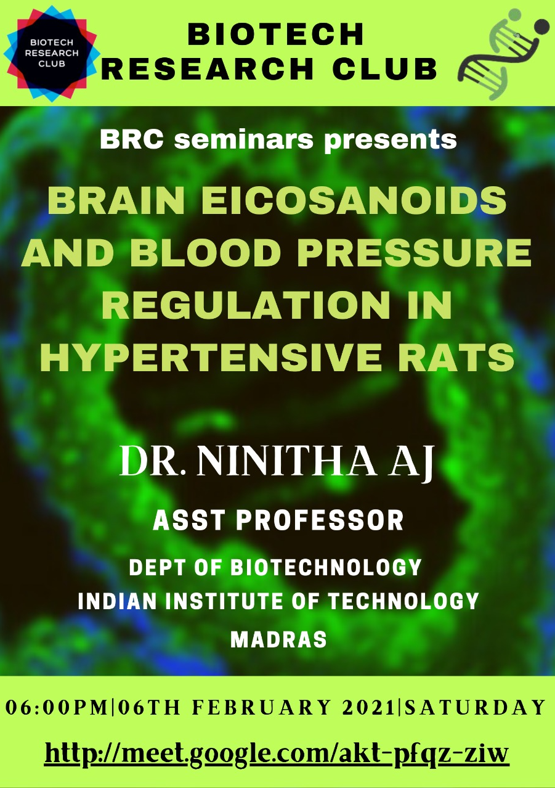
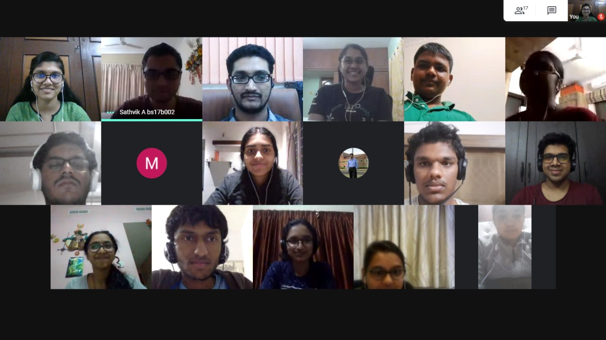
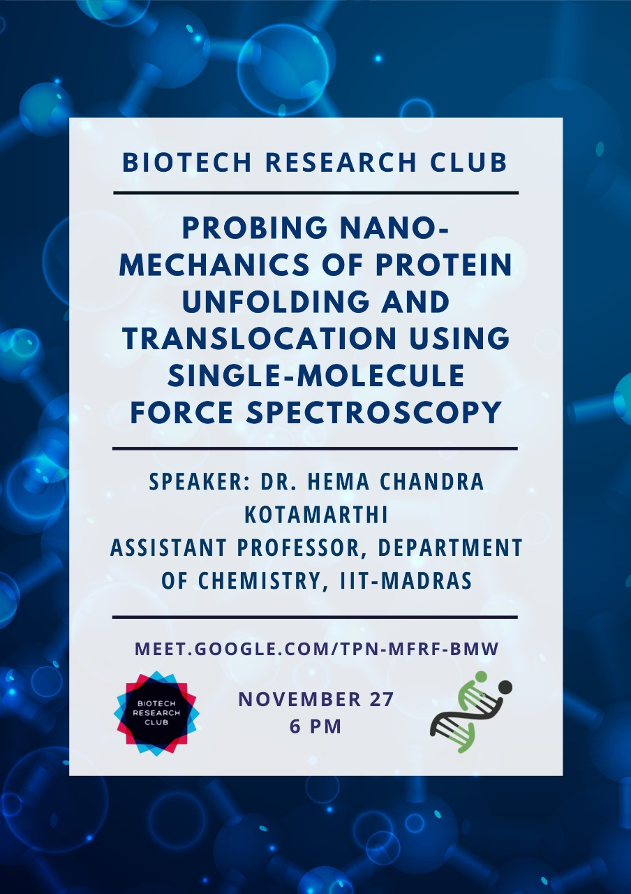

---
## Upcoming Talks
---

Stay tuned!

---
## Old Talks 
--- 

The Biotech Research Club is very excited to host Prof. Ninitha AJ, a new member of the Department of Biotechnology, Bhupat and Jyothi Mehta School of Biosciences, IIT Madras.

<b> Title: </b> Brain eicosanoids and blood pressure regulation in hypertensive rats

<b> Date and Time: </b>  Saturday, 6th February, 2021 at 6 PM

<b> Link: </b>  [https://meet.google.com/akt-pfqz-ziw](https://meet.google.com/akt-pfqz-ziw)

<b>Biography of the Speaker:</b>

Ninitha AJ completed her veterinary science degree from Madras Veterinary College, Chennai. She got her PhD from Michigan State University, where she was mentored by Professor Gregory D. Fink’s, an expert in cardiovascular and neuroscience research. For her postdoctoral training, she moved to University of Minnesota, where she studied the role of renal nerves in metabolic syndrome development and also studied the role of spinal cord stimulation in altering blood pressure regulation in human hypertensives. Later, she joined the Indian Institute of Science, Bangalore as an Inspire faculty and used whole body knock out and knock in mouse models to study cardiac hypertrophy and diabetes development.

<b> Abstract: </b>

Hypertension is a major risk factor for cardiovascular diseases like heart failure and stroke. Previously, central cyclooxygenase-1 inhibition was found to prevent the development of angiotensin II (AngII)-salt hypertension and sympathetic hyperactivity in rats. Our data suggested a significant up-regulation of lipocalin type prostaglandin D synthase (L-PGDS) mRNA levels in the organum vasculosum lamina terminalis, a circumventricular organ. This was accompanied by a significant increase in L-PGDS protein levels in the choroid plexus lining the ventricles. Therefore, it was hypothesized that the enzyme L-PGDS in the brain is critical for the development of hypertension in this model. To test this hypothesis, radio-telemeter devices were implanted in adult male Sprague Dawley rats for hemodynamic measurements. The study data established that L-PGDS is critical for the development of AngII-salt hypertension stressing the need for 1) studying the role of L-PGDS as a possible target for treating neurogenic hypertension and 2) developing targeted brain drug delivery tools in human hypertensives.

---

The Biotech Research Club is very happy to feature Prof. Hema Chandra Kotamarthi, a new member of the IIT Madras faculty. Prof. Kotamarthi obtained his Ph.D. in biophysical chemistry/molecular biophysics under the guidance of Dr. Sri Rama Koti Ainavarapu at the Tata Institute for Fundamental Research, Mumbai. He then moved to Boston and worked as a post-doctoral fellow of the Howard Hughes Medical Institute in the lab of Prof. Tania Baker in the Department of Biology, Massachusetts Institute of Technology. 
He is now an Assistant Professor at the Department of Chemistry, IIT Madras. We're excited to have you all join us for the talk.

<b> Title: </b> Probing nano-mechanics of protein unfolding and translocation using single-molecule force spectroscopy

<b> Date/Time: </b> 6 pm, 27th November 2020

<b> Link: </b> [https://meet.google.com/tpn-mfrf-bmw](https://meet.google.com/tpn-mfrf-bmw)

<b> Abstract: </b>
Single-molecule force spectroscopic (SMFS) techniques have enhanced our understanding of the role of mechanical forces in protein and enzyme biophysics, either by actively applying mechanical forces or by passively monitoring individual enzymatic processes held at a force. They have been used extensively to probe protein unfolding kinetics/pathways as well as mechanisms of biological molecular motors. In the current talk, I will discuss my research on the application of the commonly used SMFS techniques, optical tweezers (OT) and Single-molecule Atomic force microscope (SM-AFM) to probe the nano-mechanics of protein unfolding and translocation by ATP-dependent molecular motors. I will elaborate on how an OT based single-molecule assay has been applied to decipher the role of substrate directionality on protein degradation by ATP-dependent proteases as well as to probe the contribution of individual ATPase rings in a double ring protease. I will also highlight my research on the application of SM-AFM to co-relate the structure, sequence and mechanical stabilities of proteins as well as investigate the mechanical unfolding pathways of peri-plasmic binding proteins.

<b> References: </b>
1. Hema Chandra Kotamarthi, Robert Sauer, Tania Baker. “The non-dominant AAA+ ring in the ClpAP protease functions as an anti-stalling motor to accelerate protein unfolding and translocation”, Cell Reports, 2020, Vol 30, 2644-2654.
2. Adrian O. Olivares*, Hema Chandra Kotamarthi*, Benjamin J. Stein, Robert T. Sauer, and Tania A. Baker. Proceedings of National Academy of Sciences, USA, 2017, Vol 114, E6306-E6313. * Equal Contribution
3. Hema Chandra Kotamarthi, Riddhi Sharma, Sri Rama Koti Ainavarapu. Biophysical Journal, 2013, Vol 104; 2273-2281.
4. Hema Chandra Kotamarthi, Riddhi Sharma, Satya Narayan, Sayoni Ray, and Sri Rama Koti Ainavarapu. Journal of the American Chemical Society, 2013, Vol 135, 14768-14774.
